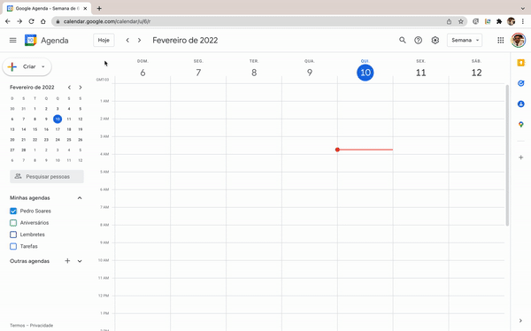

## Bem vindo ao Agenda Integrada 

**Agenda Integrada** sincroniza a Agenda de Autoridade do portal único [Gov.br](https://www.gov.br/pt-br) com os calendários do Google Agenda e Microsoft Outlook.

Criada a partir da necessidade de simplificação do registro e da divulgação das informações relativas a compromissos e agendas públicas federais, a ferramenta busca os compromissos cadastrados nas agendas do Microsoft Outlook ou do Google Agenda e cadastra-os automaticamente na única plataforma [Gov.br](https://www.gov.br/pt-br)

## Como começar?

Instale a extensão para o Google Chrome em:

> [https://chrome.google.com/webstore/detail/agenda-integrada/hdakgafffkflmfpejnbafpkgmlfjelcb](https://chrome.google.com/webstore/detail/agenda-integrada/hdakgafffkflmfpejnbafpkgmlfjelcb)

## Como utilizar?

Antes de iniciar o uso é necessário cadastrar nova **Base de Agenda**.

Clique no ícone da extensão e acesse suas configurações internas. Adicione nova base preenchendo os seguintes campos:

> **Nome da Autoridade:** Título da agenda, utilizado apena para fins de referência.

> **Tipo de Agenda:** Selecione Microsoft Outlook ou Google Agenda.

> **URL do Calendário no formato ICS:** Link disponibilizado pelo provedor de calendário. Consulte a Seção [Obtendo URL do Calendário do Microsoft Outlook ou do Google Agenda](README.md#obtendo-url-do-calendário-do-microsoft-outlook-ou-do-google-agenda) para maiores informações.

> **URL da Agenda no Gov.br:** Link da agenda da autoridade no portal único [Gov.br](https://www.gov.br/pt-br).

> **URL do serviço de integração:** Link da API de leitura do arquivo ICS. Por padrão é fornecido um serviço gratuíto em [https://seipro.app/ical/](https://seipro.app/ical/). Consulte a Seção [Criando minha própria API de leitura].

>  

## Como sincronizar?

Após cadastrada as informações de integração da Agenda, acesse a lista e inicie a sincronização.

Caso a plataforma Plone não esteja logada, você será direcionado para o login do portal único [Gov.br](https://www.gov.br/pt-br).

Caso a sincronização não seja iniciata automaticamente, clique no link **"Sincronizar Agenda"** disponível na barra superior da página.

>  

A extensão irá pesquisar e cadastrar eventos 7 (sete) dias anteriores e posteriores à data atual. 
O número de dias de pesquisa poderá ser alterado dentro das configurações internas da extensão (**Aba Geral >> Pesquisar (n) dias antes e depois da data atual**)

## Obtendo URL do Calendário do Microsoft Outlook ou do Google Agenda

### Microsoft Outlook

Acesse as configurações dos **Calendários Compartilhados** do Outlook em [https://outlook.office.com/calendar/options/calendar/SharedCalendars](https://outlook.office.com/calendar/options/calendar/SharedCalendars) ou pelo caminho Configurações >> Calendário >> Calendários compartilhados.

Na seção **Publicar um calendário**, selecione o calendário desejado. 

Selecione as permissões **Pode exibir todos os detalhes**; clique em **Publicar**.

Copie o link do calendário em formato ICS. 

>  

Cole nas configurações internas da extensão, Aba Bases de Agendas >> Campo URL do Calendário no formato ICS. 

Clique em **Salvar**

### Google Agenda

Acesse as configurações de **Integrar agenda** do Google Agenda pelo caminho Configurações >> Configurações das minhas agendas >> Integrar agenda.

Na seção **Endereço secreto no formato iCal**, clique no ícone **Copiar para a área de transferência**. 

>  

Cole nas configurações internas da extensão, Aba Bases de Agendas >> Campo URL do Calendário no formato ICS. 

Clique em **Salvar**

## Sincronizando mais de uma Agenda

É possível adicionar mais de uma **Base de Agenda** para sincronia, clicando no botão **Adicionar nova base**.

Acesse a Aba Geral e ative a opção **Sincronizar outras agendas automaticamente (caso existam)**. Ao final do processo de sincronia a próxima Agenda cadastrada será automaticamente sincronizada.

## Criando sua própria API de leitura

Para que seja possível interpretar as informações de compromissos agendados nos calendários no Microsoft Outlook ou Google Agenda é utilizado um serviço de API simples, disponibilizado gratuitamente no endereço [https://seipro.app/ical/](https://seipro.app/ical/).

Caso deseje utilizar sua própria API de leitura, utilize os arquivos da pasta [/ICAL](/ical) em um servidor de dados PHP. Aponte para o domínio criado nas configurações da Agenda: Aba Bases de Agenda >> Campo URL do serviço de integração
